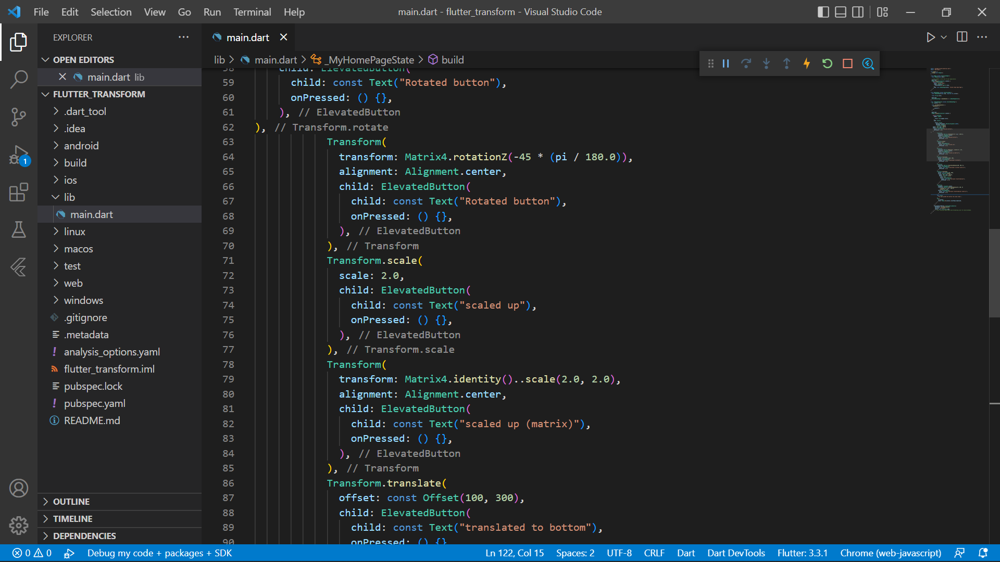
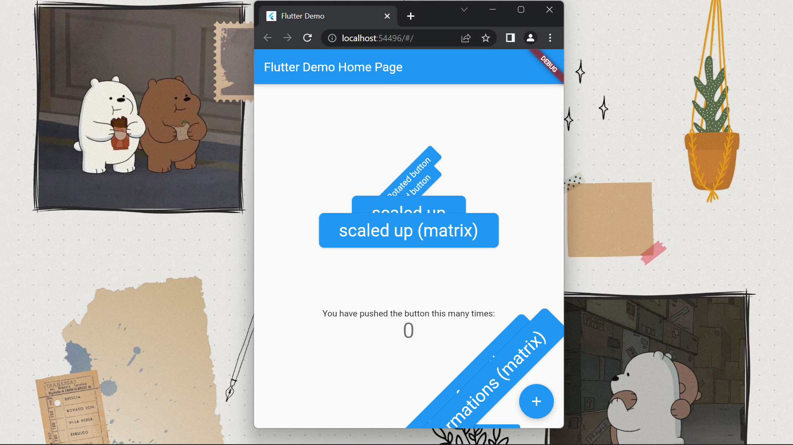
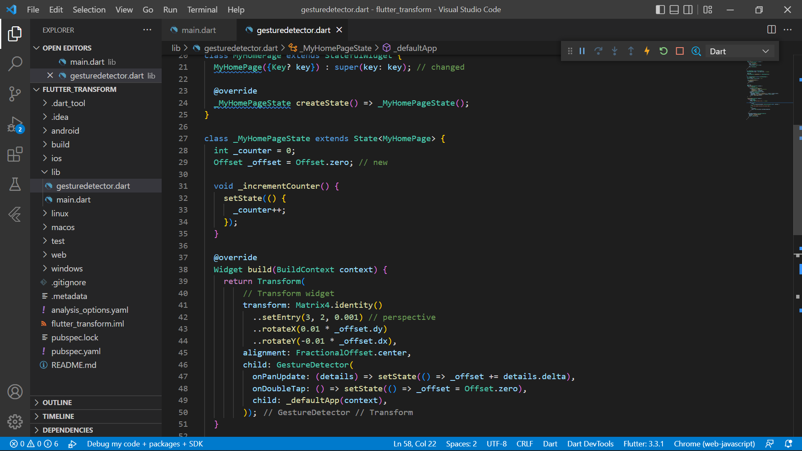
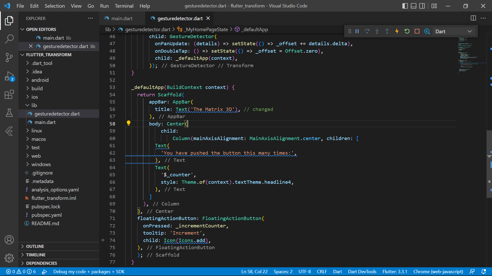
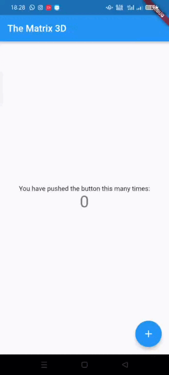
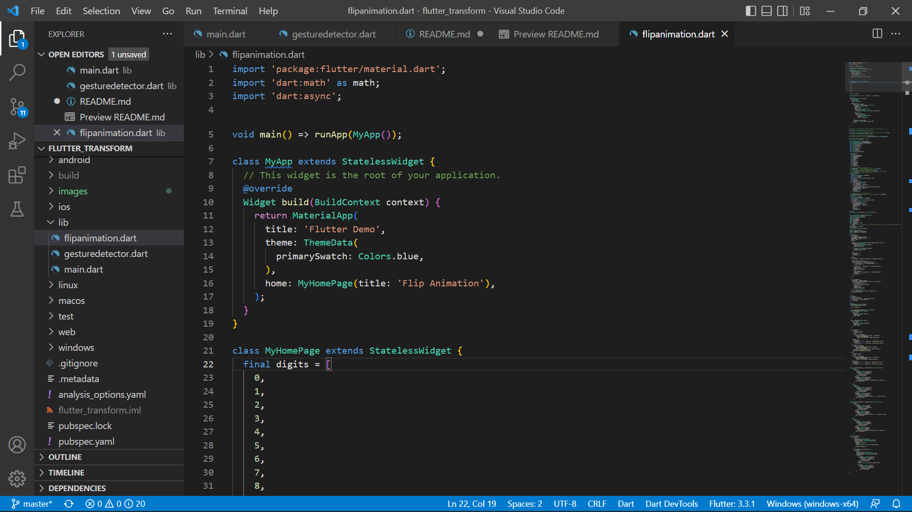
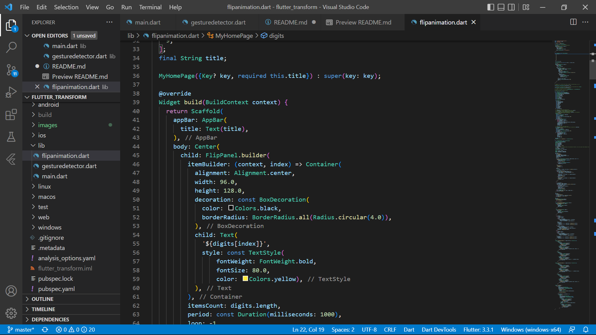

# **Tugas Pertemuan 27**
## **Project flutter_transform**

### Praktikum 1 : Tambahkan kode Transform
* Menambahkan code transform pada main.dart

* Run project

### Praktikum 2 : Perspective on Flutter
* menambahkan Transform widget dan GestureDetector widget

* Run Project

### Praktikum 3 : Make 3D flip animation
* Menambahkan code dibawah ini pada file main.dart

* Hasil Run Project

